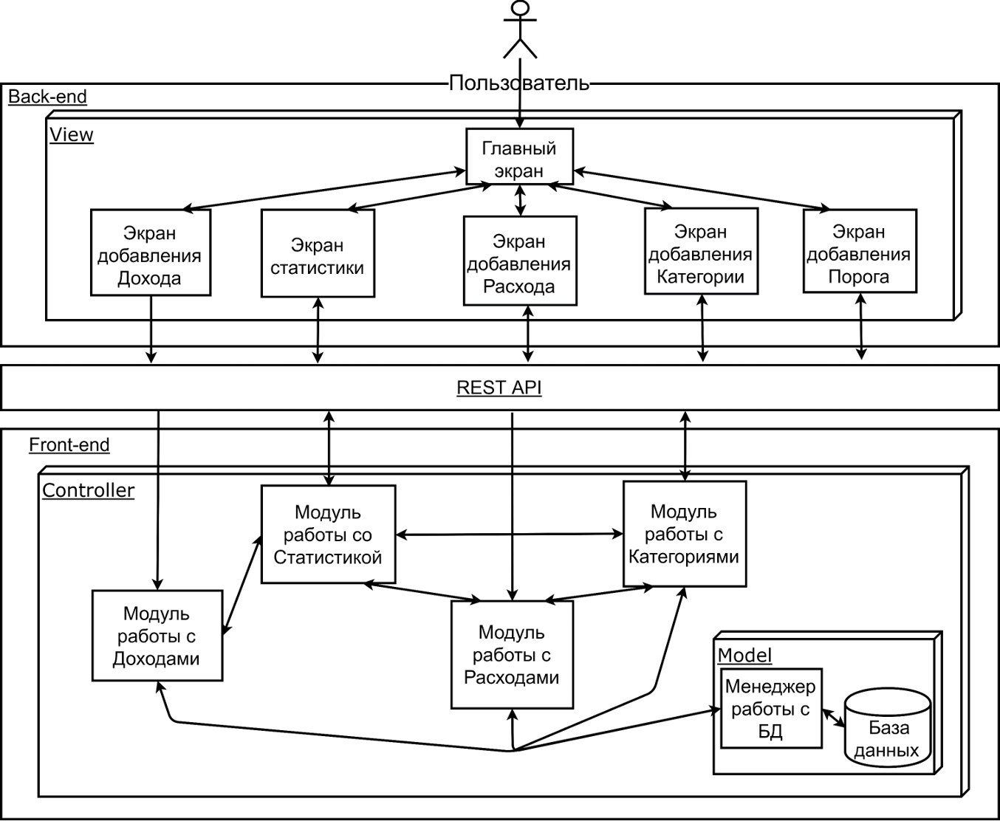

# MoneyKeeper

Мобильное приложение для контроля расходов.

 - radiatus - Борисов, 3 гр.
 - Drawell - Никонов, 3 гр.

# Trello

[Страница команды](https://trello.com/b/ymq1o1vV)

# Документация

- [Курсовая docx](./Documents/Project.docx)
- [Курсовая pdf](./Documents/Project.pdf)
- [ТЗ doc](./Documents/TZ.doc)
- [ТЗ pdf](./Documents/TZ.pdf)
- [Отчет по обязанностям docx](./Documents/Otchet_po_rabote.docx)
- [Отчет по обязанностям pdf](./Documents/Otchet_po_rabote.pdf)

# Диаграммы

- [Диаграммы img](./Diagrams/img/)
- [Диаграммы src](./Diagrams/src/)

# Приложение

- [Front-End](./MoneyKeeper/)
- [Back-End](https://github.com/Drawell/MoneyKeeperSpring)

# Презентация

- [PPTX](./Documents/pres.pptx)
- [PDF](./Documents/pres.pdf)

# Архитектура

# Swagger

>Для перехода нужно кликнуть по картинке Swagger-а

>ВНИМАНИЕ! Так как мы используем бесплатный план подписки для развертывания на Heroku, приложение может "засыпать" после 30 минут отсутсвия активности. В случае, если при переходе по ссылке ничего нет, подождите 1-2 минуты и обновите страницу.
----
# Demo

